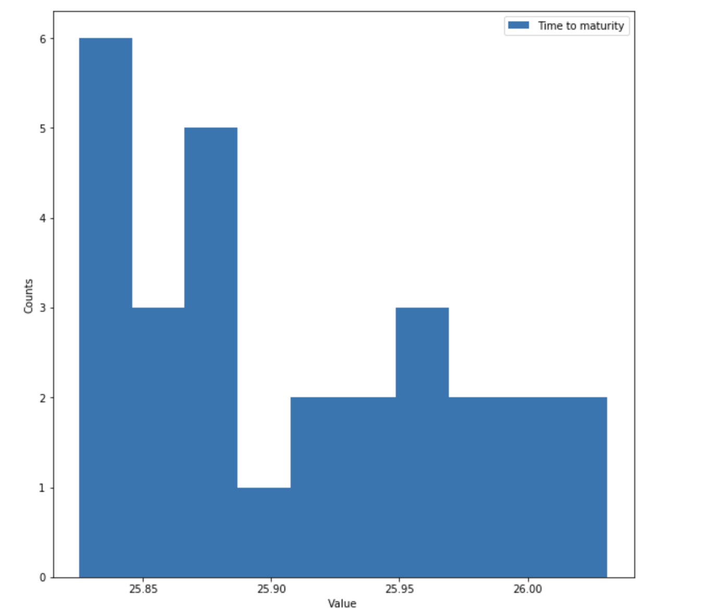

```{r setup, include = FALSE}
library("papaja")
r_refs("r-references.bib")
```

```{r analysis-preferences}
# Seed for random number generation
set.seed(42)
knitr::opts_chunk$set(cache.extra = knitr::rand_seed)
```
# Introduction

A bond valuation uses a yield to maturity or a zero yield curve using a few points on the par bond or Nelson Siegel parameters. The bond is valued using the settlement date and maturity date using an algorithm that can calculate the time to maturity and each coupon date. Maturity can be in years; if unavailable, a zero maturity date is used. This mode is particularly convenient for price par bonds or price other bonds on issue dates or coupon dates. Using this mode between coupon dates is difficult as the user has to compute the day count and year fraction and provide the maturity as, say, 5.3 years. Traditionally bond price was calculated using YTM(Yield to maturity) or zero yield curve. However, this approach does not predict an accurate price of a bond because it does not consider other parameters such as inflation. We have used the LSTM model to predict trade price based on the last trade price, which can be improved further to consider external factors such as inflation. 
Long short-term memory (LSTM) is an artificial neural network in artificial intelligence. Unlike standard feedforward neural networks, LSTM has feedback connections. Such a recurrent neural network (RNN) can process not only single data points but also entire data sequences and is also suitable for analyzing time series data. 

# Background 
As far as price transparency is concerned, there has historically been a huge gap between the amount of reference information available to those trading equities versus those trading corporate bonds.  Stock exchanges report trades, bids and offers at all times.  Free access is available online with a 15 minute delay while traders who demand more information can pay for ultra efficient real time data and information about size of current bids and offers. By contrast, bond trades are required to be reported within 15 minutes and only those who pay for the TRACE feed can access this information.  No quotes are publicly available and the best way to get a quote is to solicit multiple brokers and wait for a reply.  Alternatively there are data companies that provide end of day prices, published after the market has closed and with no guarantee that the specific information sought will be included.  Accurate bond pricing is also hindered by lack of liquidity.  Only a fraction of TRACE eligible bonds trade on a given day, so the most recent trade price is often multiple days old.  Pricing bonds based on other more liquid bonds that have similar features is common, but again limited by the presence of such bonds.\par
   Thus, in the context of bond price predictions, machine learning should be fast and accurate. They have evaluated the performance of various supervised learning algorithms for regression followed by ensemble methods, with feature and model selection considerations being treated in detail(@ganguli2017machine). (@gotze2020improving) compares the forecasting performance of linear regression models and enhanced machine learning methods in the catastrophe (CAT) bonds market using linear regression with variable selection, penalization methods, random forests, and neural networks to forecast CAT bond premia. Random forests exhibit the highest forecasting performance among the considered models, followed by linear regression models and neural networks.\par
   
Benchmark Solutions is the first provider of realtime corporate bond prices. Every 10 seconds they provide accurate prices that incorporate interest rate data, trades or quotes of the bond in question, trades or quotes of other bonds or CDS of the issuer of the bond in question as well as other input sources.  Pricing bonds accurately requires an exacting knowledge of payment schedules, trading calenders and reference data for each bond.  This, as well as synthesizing all of the bonds and CDS quotes and trades of a given issuer into implied hazard and funding curves, is something that they feel is beyond the scope of this challenge. (@golbayani2020comparative) Rather, they provide you with a reference price which is an intermediate result of our calculations and is labeled 'curve_based_price'  in the dataset. Thus the competition focuses on trading dynamics and microstructure of individual bonds, rather than all bonds from a given issuer. (@ganguli2017machine) proposes a novel hybrid time-series aided machine learning method that could be applied to such datasets in future work.\par

Benchmark solutions are the first provider of real-time corporate bond prices discussed in (@medium). Every 10 seconds, they provide accurate prices that incorporate interest rate data, trades or quotes of the bond in question, trades or quotes of other bonds or CDS of the issuer of the bond in question, and other input sources. Pricing bonds accurately requires exacting knowledge of payment schedules, trading calendars, and reference data for each bond. This, as well as synthesizing all of the bonds and CDS quotes and trades of a given issuer into the implied hazard and funding curves, is something that we feel is beyond the scope of this challenge. Rather, we provide you with a reference price which is an intermediate result of our calculations and is labeled 'curve_based_price'  in the dataset. Thus the competition focuses on trading dynamics and microstructure of individual bonds rather than all bonds from a given issuer. 


# Methods
This research paper's methodology focuses on quantitative aspects of bond price prediction. These variables are not the extent of dependency but have provided a credible amount of accuracy in the  past to other researchers. Simple linear regression and Long Short Term model (LSTM) are used to estimate the prices using the significantly important variables. LSTM proved to be more effective for sequential data. 

## Data
The dataset is downloaded from Kaggle. US corporate bond trade data is provided.  Each row includes trade details, some basic information about the traded bond, and information about the previous ten trades. The data is discussed below. There are 3736 unique bonds present in the data. While we can use this as one Id in the real world, there is no bond_id in the test.csv file, so we can either prepare data using it or drop it. But, dropping bond_id is losing meaningful info, so we will create one function we can use for each bond Id to construct time-series data for it, and then we will train some models on it.\par

id: The row id. bond_id: The unique id of a bond to aid in time series reconstruction. (This column is only present in the train data). 3736 unique bond ids, varying from 12,129 data points to 1 per id.
trade_price: The price at which the trade occurred. (This is the column to predict in the test data). Mean: 103.44, Median: 102.33, STD: 9.82.
weight: The weight of the row for evaluation purposes. This is calculated as the square root of the time since the last trade and then scaled so the mean is 1.
current_coupon: The coupon of the bond at the time of the trade.
time_to_maturity: The number of years until the bond matures at the time of the trade.
curve_based_price: A fair price estimate based on implied hazard and funding curves of the issuer of the bond.
reporting_delay: The number of seconds after the trade occured that it was reported.
trade_size: The notional amount of the trade.


The above plot shows how the maturity time is distributed for a given bond. Sometimes it is helpful to decide which type of bonds have a high maturity time and which have less; The bond price can change a lot based on that.


The above plot shows the count of different traders that have done trade: 2=customer sell, 3=customer buy, 4=trade between dealers. We would expect customers to get worse prices on average than dealers.


## Procedure
We can not use the id column at all. So we drop it first. Then we create one function to take our data frame and construct time series data from it. It means that the next trade price will be the output for the current trade. This way, we provide the existing data to predict the next trade price. We have more than 3000 unique bonds. So for all of those bonds, we have to construct the time series data. So, we group by object and then apply our function to create the time-series data. Then we combine all the data into one data frame for further usage. The above data frame has our last column as output. We do not need the bond_id column as it has no valuable information for us. Also, this column is not present in the test.csv file for the competition. So, we try to look closely at the competition data. Then, we scale the data from 0 to 1. This way, our model can fit the data best as normalized. Finally, it is time to split the data into train and test data. We will use 90% of the data to train the model and the rest 10% for testing our model. We will use the LSTM model to reshape our data as per the required shape of the LSTM.\par
  Now we build our model. We are using the Keras library, which is running on top of TensorFlow. We create a simple LSTM model with one LSTM and one Dense layer for output. In the output layer, we use linear activation as our final output is price, which is float. Now, it is time to train the model. Now, as our model is trained, let's test it. We make predictions on the test data and then check out the root mean square error of the predictions. In doing so, we also need to convert the normalized data into raw data. We can do this by using MinMaxScaler inverse_transform function. The above-predicted prices are close to the accurate prices. Of course, there can be chances of data leakage or some other issue like the overfitting of the model. But, it shows us the LSTM network's potential to predict the bond trade price given the historical data.


## Data analysis
After seeing the results of (@ganguli2017machine) we decided to assert most of our efforts into developing RNN-LSTM or Long Short-Term Memory Neural Network. LSTMs are great for working with time series data as their weights are longer depending on time series lag. However, this can substantially slow down the processing speed by having to save these specific weights, which was the case with this model. It took well over 5 hours to reach convergence.

# Results

LSTM NN which came close to the first NN in accuracy but took substantially longer to run, reaching convergence at just over 100 epochs taking 5 hours and 22 minutes.


# Discussion/ Future work

In the testing process, we were limited by computing processing capability. First, we started using data bricks, which was also very slow. Next, we ran on both  GPU and CPU, which improved our testing times but was still a substantial barrier to adjusting our tests. Further, improved computational power would enable faster fine-tuning of the neural networks.
While this dataset was extensive, it lacked factual historical information. This could have substantially improved the results of both of our NNs, most notably the LSTM. Therefore, further implementing our model would seek to pursue additional data.


\newpage

# References

::: {#refs custom-style="Bibliography"}
:::
