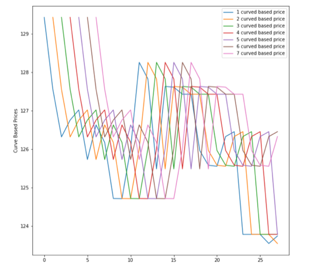

```{r setup, include = FALSE}
library("papaja")
r_refs("r-references.bib")
```

```{r analysis-preferences}
# Seed for random number generation
set.seed(42)
knitr::opts_chunk$set(cache.extra = knitr::rand_seed)
```
# Introduction

A bond valuation uses a yield to maturity or a zero yield curve using a few points on the par bond or Nelson Siegel parameters. The bond is valued using the settlement date and maturity date using an algorithm that can calculate the time to maturity and each coupon date. Maturity can be in years; if unavailable, a zero maturity date is used. This mode is particularly convenient for price par bonds or price other bonds on issue dates or coupon dates. Using this mode between coupon dates is difficult as the user has to compute the day count and year fraction and provide the maturity as, say, 5.3 years. Traditionally bond price was calculated using YTM(Yield to maturity) or zero yield curve. However, this approach does not predict an accurate price of a bond because it does not consider other parameters such as inflation. We have used the LSTM model to predict trade price based on the last trade price, which can be improved further to consider external factors such as inflation. Long short-term memory (LSTM) is an artificial neural network in artificial intelligence. Unlike standard feedforward neural networks, LSTM has feedback connections. Such a recurrent neural network (RNN) can process not only single data points but also entire data sequences and is also suitable for analyzing time series data. 

# Background
As far as price transparency is concerned, there has historically been a massive gap between the amount of reference information available to those trading equities versus those trading corporate bonds. Stock exchanges report trades, bids, and offers at all times. Free access is available online with a 15-minute delay. At the same time, traders who demand more information can pay for ultra-efficient real-time data and information about the size of current bids and offers. By contrast, bond trades must be reported within 15 minutes, and only those who pay for the TRACE feed can access this information. No quotes are publicly available, and the best way to get a quote is to solicit multiple brokers and wait for a reply. Alternatively, some data companies provide end-of-day prices published after the market has closed and with no guarantee that the specific information sought will be included. A lack of liquidity also hinders accurate bond pricing. Only a fraction of TRACE-eligible bonds trade on a given day, so the most recent trade price is often multiple days old. Pricing bonds based on other more liquid bonds with similar features are common but again limited by the presence of such bonds.\par
   Thus, machine learning should be fast and accurate in the context of bond price predictions. They have evaluated the performance of various supervised learning algorithms for regression followed by ensemble methods, with feature and model selection considerations being treated in detail(@ganguli2017machine). (@gotze2020improving) The forecasting performance of linear regression models and enhanced machine learning methods in the catastrophe (CAT) bonds market using linear regression with variable selection, penalization methods, random forests, and neural networks to forecast CAT bond premia. Random forests exhibit the highest forecasting performance among the considered models, followed by linear regression models and neural networks.\par
   
Benchmark Solutions is the first provider of real-time corporate bond prices. Every 10 seconds, they provide accurate prices that incorporate interest rate data, trades or quotes of the bond in question, trades or quotes of other bonds or CDS of the issuer of the bond in question, and other input sources. Pricing bonds accurately requires exacting knowledge of payment schedules, trading calendars, and reference data for each bond. This, as well as synthesizing all of the bonds and CDS quotes and trades of a given issuer into an implied hazard and funding curves, is something that they feel is beyond the scope of this challenge. (@golbayani2020comparative) Instead, they provide you with a reference price which is an intermediate result of our calculations and is labeled 'curve_based_price' in the dataset. Thus the competition focuses on trading dynamics and microstructure of individual bonds rather than all bonds from a given issuer. (@ganguli2017machine) proposes a novel hybrid time-series aided machine learning method that could be applied to such datasets in future work.\par

Benchmark solutions are the first provider of real-time corporate bond prices discussed in (@medium). Every 10 seconds, they provide accurate prices that incorporate interest rate data, trades or quotes of the bond in question, trades or quotes of other bonds or CDS of the issuer of the bond in question, and other input sources. Pricing bonds accurately requires exacting knowledge of payment schedules, trading calendars, and reference data for each bond. This, as well as synthesizing all of the bonds and CDS quotes and trades of a given issuer into the implied hazard and funding curves, is something that we feel is beyond the scope of this challenge. Instead, we provide you with a reference price which is an intermediate result of our calculations and is labeled 'curve_based_price' in the dataset. Thus the competition focuses on trading dynamics and microstructure of individual bonds rather than all bonds from a given issuer. \par

# Methods
This research paper's methodology focuses on quantitative aspects of bond price prediction. These variables are not the extent of dependency but have provided a reasonable amount of accuracy in the past to other researchers. Simple linear regression and the Long Short Term model (LSTM) are used to estimate the prices using the significantly essential variables. LSTM proved to be more effective for sequential data.

## Data
The dataset is downloaded from Kaggle. US corporate bond trade data is provided. Each row includes trade details, some basic information about the traded bond, and information about the previous ten trades. The data is discussed below. There are 3736 unique bonds present in the data. While we can use this as one Id in the real world, there is no bond_id in the test.csv file, so we can either prepare data using it or drop it. But, dropping bond_id is losing meaningful info, so we will create one function we can use for each bond Id to construct time-series data for it, and then we will train some models on it. Here we have listed the important parameters in determining the bond prices:

* id: The row id. bond_id: The unique id of a bond to aid in time series reconstruction. (This column is only present in the train data). Three thousand seven hundred thirty-six unique bond ids, varying from 12,129 data points to 1 per id.
* trade_price: The price at which the trade occurred. (This is the column to predict in the test data). Mean: 103.44, Median: 102.33, STD: 9.82.
* weight: The weight of the row for evaluation purposes. This is calculated as the square root of the time since the last trade and then scaled, so the mean is 1.
* current_coupon: The bond's coupon at the time of the trade.
* time_to_maturity: The number of years until the bond matures at the time of the trade.
* curve_based_price: A fair price estimate based on implied hazard and funding curves of the issuer of the bond.
* reporting_delay: The number of seconds after the trade occurred that it was reported.
* trade_size: The notional amount of the trade.## Data

## Data Analysis

Now that we have determined the important parameters in our dataset, we wanted to see how these variables are distributed descriptively and how each of these impacts bond pricing theoretically. As suggested in the paper by He, Xin and Feng, Guanhao and Wang, Junbo and Wu, and Chunchi (2021), historical prices are the most important predictors for the bond pricing model. Although the writers had both public and private bonds in their dataset, using the same hypothesis, we have also included both Trade Price and the Curve_based_price (Fair price of the bond) to have a more accurate model. \par


Graph1 shows how the maturity time is distributed for a given bond in our data. Sometimes it is helpful to decide which type of bonds have a high maturity time and which have less; The bond price can change a lot based on that. Maturity is instrumental when trying to calculate the Yield to maturity of a bond, which is very useful in understanding and estimating the potential return of the bond. The returns on a bond also help determine the pricing since the higher the Yield, the higher the price. Additionally, Yield also helps determine the risk associated with the bond. The riskier the bond, the higher the Yield since the buyer needs to be compensated for the additional risk they will be taking buying the bond. \par
$Yield to Maturity = [Annual Interest + {(FV-Price)/Maturity}] / [(FV+Price)/2]$


Graph 2 depicts the plot with all the trader types we have in the data. The different types of Traders in the data are 2=customer sell, 3= customer buy, and 4=Trade between traders. This shows that most of the trades in our dataset are made by customers and are taking a long position. This can be crucial when using this algorithm on a different dataset since it might present different results if used when most trades are short positions or conducted by Traders. Bond traders act as the middle market for investors. Customers would be using brokers/bond traders to make their investments in the capital market since consumers cannot directly enter the bond market. They are compensated for their services on a fee or profit-sharing percentage basis. The traders need to understand the complex intricacies of the parameters that might affect bond performance and returns. Given that most of our data set are consumers, we might expect a smaller trade size/volume.\par


Graph 3 depicts the Trade size in our dataset. As expected, the trade size is small since most of our trades are for customers. As a consumer, the volume is expected to be low. Therefore, this adds another level of niche/assumption to our model. It will be more accurate for trades that are low in volume rather than huge volume trades. We might need to recalibrate our model with high-volume data to get more accurate results. Although the bond price theoretically is not impacted by the trade price, however, when huge volumes are considered, they impact the supply and demand of the bonds and thus impact the bond price. \par



Graph 4 depicts the curve-based price for the last seven trades across bond maturities. Through this descriptive plot, we wanted to see if the bond prices vary widely. We would need additional data manipulation to have a more normalized price distribution and not include any significant outliers that might skew our prices. Interestingly, before the financial crisis, periods of financial stress had resulted in market conditions represented by fatter tails. Fatter tails mean there are higher chances of extreme values to occur than the normal values. Given we have a smaller dataset and a very niche dataset, we would want to have prices behave more normally than otherwise. Although our model LSTM is a robust algorithm to adjust prices' non-normal behavior, the accuracy would be higher with a bigger dataset. Hence one takeaway would be to constantly update and expand on the dataset, to recalibrate the model and achieve higher predictive accuracy.

## Procedure
We cannot use the id column at all. So we drop it first. Then we create one function to take our data frame and construct time series data from it. It means that the next trade price will be the output for the current trade. This way, we provide the existing data to predict the next trade price. We have more than 3000 unique bonds. So for all of those bonds, we have to construct the time series data. So, we group by object and then apply our function to create the time-series data. Then we combine all the data into one data frame for further usage. The above data frame has our last column as output. We do not need the bond_id column as it has no valuable information for us. Also, this column is not present in the test.csv file for the competition. So, we try to look closely at the competition data. Then, we scale the data from 0 to 1. This way, our model can fit the data best as normalized. Finally, it is time to split the data into train and test data. We will use 90% of the data to train the model and the rest 10% for testing our model. We will use the LSTM model to reshape our data as per the required shape of the LSTM. \par
 Now we build our model. We are using the Keras library, which is running on top of TensorFlow. We create a simple LSTM model with one LSTM and one Dense layer for output. In the output layer, we use linear activation as our final output is price, which is float. Now, it is time to train the model. Now, as our model is trained, let's test it. We make predictions on the test data and then check out the root mean square error of the predictions. In doing so, we also need to convert the normalized data into raw data. We can do this by using MinMaxScaler inverse_transform function. The above-predicted prices are close to the accurate prices. Of course, there can be chances of data leakage or some other issue like the overfitting of the model. But, it shows us the LSTM network's potential to predict the bond trade price given the historical data. \par

After seeing the results of (Ganguli and Dunnmon (2017)), we decided to assert most of our efforts into developing RNN-LSTM or Long Short-Term Memory Neural Network. LSTMs are great for working with time series data as their weights are longer depending on time series lag. However, this can substantially slow down the processing speed by having to save these specific weights, which was the case with this model. It took well over 5 hours to reach convergence.\par

# Results
An essential aspect of these results is the consideration of speed AND accuracy. Benchmark Solutions wanted actionable information which could be fast and effective. LSTM NN came close to the first NN in accuracy but took substantially longer to run, reaching convergence at just over 100 epochs, taking 5 hours and 22 minutes. The result below shows us that our predicted price was very close to the real trade price. 


The Trade Price determines the valuation of a bond in our algorithm. Typically bond pricing would involve calculating the bond's cash flow or the present value of a bond's future interest payments as well as its face value, which is the bond's value once it matures. However, this model uses the historical Fair Price and the trade price of the bond to provide another layer of predictability power to the model. However, since our model only has coupon bonds as input, it is a niche model in its performance since zero-coupon bonds have different characteristics than a coupon bond. Public (sovereign, municipal) bonds also have different characteristics from private corporate bonds. For example, corporate bonds are riskier, have lower ratings than government bonds, and are priced higher. Through this project, we have attempted to predict bond prices with a given maturity since this can be a useful tool for a trader to determine the Yield of a bond, which would help them determine the return on the investment.

# Discussion/ Future work

In the testing process, we were limited by computing processing capability. First, we started using data bricks, which was also very slow. Next, we ran on both GPU and CPU, which improved our testing times but was still a substantial barrier to adjusting our tests. Further, improved computational power would enable faster fine-tuning of the neural networks. Finally, while this dataset was extensive, it lacked factual historical information. This could have substantially improved the results of both of our NNs, most notably the LSTM. Therefore, further implementing our model would seek to pursue additional data.
\newpage

# References

::: {#refs custom-style="Bibliography"}
:::
